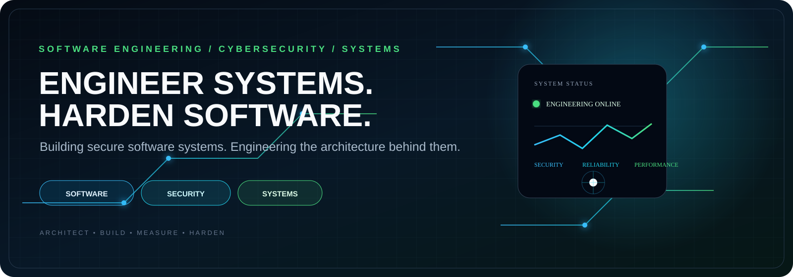
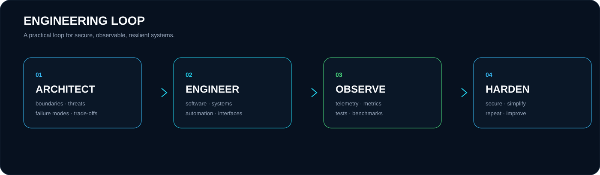
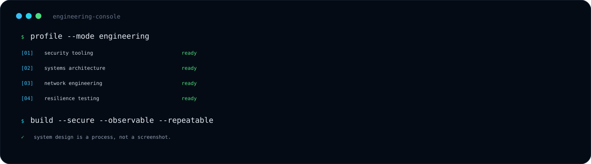

<div align="center">



<br/>


<br/><br/>

### Building secure software systems. Engineering the architecture behind them.

</div>


## ◈ ENGINEERING PROFILE

I design and build **secure, resilient software systems** across application, network, and infrastructure layers.

My approach is deliberately engineering-first:

> **Architecture before complexity.  
> Security by design.  
> Performance measured.  
> Failure expected.  
> Systems continuously improved.**

<div align="center">

| SOFTWARE | SECURITY | SYSTEMS | INFRASTRUCTURE |
|:---:|:---:|:---:|:---:|
| Architecture | Security Engineering | Networking | Containers |
| APIs & Tooling | Recon & Assessment | Linux | Automation |
| Maintainability | Application Security | Runtime Behavior | CI/CD |
| Performance | Resilience | TCP/IP · HTTP | Observability |

</div>

---

## ◈ SELECTED SYSTEMS

<table>
<tr>
<td width="33%" valign="top">

### `01` · PortX

**Ultra-fast cross-platform network tooling**

A Kotlin Multiplatform network scanner focused on adaptive timing, controlled concurrency, native delivery, and a clean security-tooling workflow.

**Built with**

`Kotlin` `KMP` `Ktor` `Compose`

**Focus**

Network Security · Performance · Cross-platform

**→** [Open repository](https://github.com/mr-coder20/PortX)

</td>

<td width="33%" valign="top">

### `02` · FireScan

**Hybrid reconnaissance engine**

A Go orchestration layer combining multiple scanning engines with automatic selection, fallback, structured output, and automation-friendly workflows.

**Built with**

`Go` `Networking` `CLI` `Automation`

**Focus**

Reconnaissance · Orchestration · Tooling

**→** [Open repository](https://github.com/mr-coder20/FireScan)

</td>

<td width="33%" valign="top">

### `03` · L7 Resilience Scanner

**Layer-7 resilience & traffic analysis**

Controlled HTTP/HTTPS testing and traffic-analysis tooling for understanding application behavior, resilience, and response patterns.

**Built with**

`Python` `HTTP` `Concurrency` `Security`

**Focus**

Application Security · Resilience · Traffic Analysis

**→** [Open repository](https://github.com/mr-coder20/L7-Resilience-Scanner)

</td>
</tr>
</table>



---

## ◈ ENGINEERING CONSOLE



---

## ◈ TECHNOLOGY SURFACE

```text
┌─────────────────────────────────────────────────────────────────┐
│  LANGUAGES                                                      │
│  Kotlin · Go · Python · Java · SQL                              │
├─────────────────────────────────────────────────────────────────┤
│  SOFTWARE ENGINEERING                                           │
│  Architecture · APIs · CLI Tooling · Automation · Testing      │
├─────────────────────────────────────────────────────────────────┤
│  SECURITY                                                       │
│  Reconnaissance · Network Security · AppSec · Resilience       │
├─────────────────────────────────────────────────────────────────┤
│  SYSTEMS                                                        │
│  Linux · Docker · TCP/IP · HTTP · Networking · Runtime          │
├─────────────────────────────────────────────────────────────────┤
│  DELIVERY                                                        │
│  Git · GitHub Actions · CI/CD · Documentation · Reproducibility │
└─────────────────────────────────────────────────────────────────┘
```

---

## ◈ ENGINEERING PRINCIPLES

<table>
<tr>
<td width="50%" valign="top">

**01 — CLARITY**

Complex systems should have understandable boundaries.

**02 — SECURITY**

Threats belong in the architecture, not at the end of delivery.

**03 — MEASUREMENT**

Performance claims should be backed by repeatable measurements.

</td>
<td width="50%" valign="top">

**04 — RESILIENCE**

Failure is a design input, not an exception to the design.

**05 — AUTOMATION**

Repeatable work should become repeatable tooling.

**06 — MAINTAINABILITY**

A system is not finished when it works; it is finished when it can evolve.

</td>
</tr>
</table>

---

## ◈ CURRENT VECTOR

```text
SECURITY ENGINEERING
        │
        ├── security tooling
        ├── controlled assessment
        └── application security

SYSTEMS ENGINEERING
        │
        ├── networking
        ├── containers
        └── runtime behavior

RESILIENT SOFTWARE
        │
        ├── observability
        ├── performance
        └── failure-aware design
```

---

## ◈ OPEN SOURCE SIGNAL

I build tools with a preference for:

**Useful → Reproducible → Documented → Measurable → Maintainable**

The goal is not to make software look impressive.

The goal is to make the **system itself** impressive.

---

## ◈ PROFILE LINKS

<div align="center">

[](https://github.com/mr-coder20)
[](https://t.me/a_god_3_6_9)

<br/><br/>

`SOFTWARE ENGINEER` · `CYBERSECURITY` · `SYSTEMS` · `INFRASTRUCTURE`

<br/>

<sub>Design systems. Build deliberately. Harden continuously.</sub>

</div>
