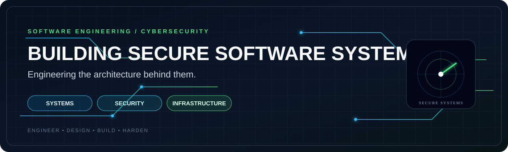
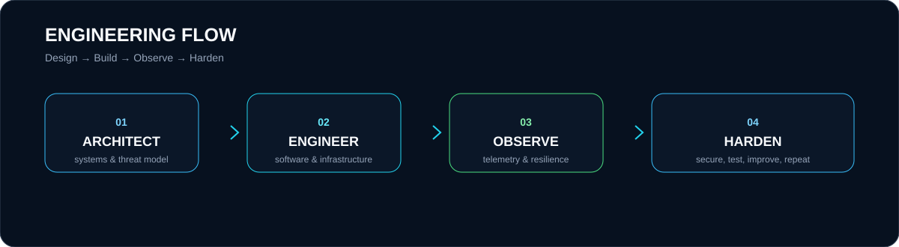

<div align="center">



<br/>

[](https://github.com/mr-coder20)
[](https://github.com/mr-coder20)
[](https://github.com/mr-coder20)
[](https://github.com/mr-coder20)

<br/>

**Building secure software systems. Engineering the architecture behind them.**

</div>


## Engineering Profile

I build software systems where **security, reliability, performance, and architecture** have to work together.

My work sits at the intersection of:

- **Software Engineering** — architecture, backend systems, tooling, automation
- **Cybersecurity** — security engineering, reconnaissance, application security
- **Systems & Infrastructure** — networking, containers, observability, resilient environments
- **Engineering Leadership** — turning technical requirements into structured, maintainable systems

> **Principle:** Build it clearly. Measure it honestly. Harden it continuously.

---

## Selected Systems

<table>
<tr>
<td width="33%" valign="top">

### PortX
**Cross-platform network security tooling**

Kotlin Multiplatform scanner focused on fast discovery, adaptive timing, bounded concurrency, and native desktop/mobile delivery.

**Stack:** Kotlin · KMP · Ktor · Compose

[→ Repository](https://github.com/mr-coder20/PortX)

</td>
<td width="33%" valign="top">

### FireScan
**Hybrid reconnaissance engine**

A Go-based orchestration layer for Masscan, Nmap, RustScan, Naabu, and a native fallback engine, with structured output and automation.

**Stack:** Go · Networking · CLI · Automation

[→ Repository](https://github.com/mr-coder20/FireScan)

</td>
<td width="33%" valign="top">

### L7 Resilience Scanner
**HTTP resilience & traffic analysis**

Layer-7 testing and traffic-analysis tooling designed around controlled, authorized resilience experiments.

**Stack:** Python · HTTP · Concurrency · Security

[→ Repository](https://github.com/mr-coder20/L7-Resilience-Scanner)

</td>
</tr>
</table>

---



## Engineering Matrix

| Domain | Focus |
|---|---|
| **Software Engineering** | Architecture · APIs · tooling · maintainability |
| **Cybersecurity** | Security testing · reconnaissance · application security |
| **Systems** | Networking · Linux · containers · runtime behavior |
| **Infrastructure** | Docker · automation · observability · deployment |
| **Performance** | concurrency · resource control · benchmarking |
| **Delivery** | documentation · reproducibility · engineering workflow |

---

## Technology Surface

```text
LANGUAGES
Kotlin ─ Go ─ Python ─ Java ─ SQL

SYSTEMS
Linux ─ Docker ─ Networking ─ TCP/IP ─ HTTP

ENGINEERING
Kotlin Multiplatform ─ Compose ─ Ktor ─ CLI Tooling

SECURITY
Reconnaissance ─ Port Scanning ─ Traffic Analysis
Application Security ─ Resilience Testing ─ Security Automation

WORKFLOW
Git ─ GitHub Actions ─ CI/CD ─ Testing ─ Documentation
```

---

## What I Optimize For

```text
┌──────────────────────────────────────────────────────────────┐
│  CLARITY       → systems people can understand               │
│  SECURITY      → threats considered by design                │
│  PERFORMANCE   → measured, not guessed                       │
│  RESILIENCE    → failure is part of the design               │
│  AUTOMATION    → repeatable engineering workflows            │
│  QUALITY       → maintainable software over short-term hacks │
└──────────────────────────────────────────────────────────────┘
```

---

## Current Vector

**01 — Security Engineering**  
Designing practical security tooling and controlled assessment workflows.

**02 — Systems Engineering**  
Exploring the boundary between software architecture, networking, runtime behavior, and infrastructure.

**03 — Resilient Software**  
Building systems that remain observable, testable, and predictable under pressure.

---

## Open Source

I prefer projects that are useful beyond a single machine:

**reproducible → documented → measurable → maintainable**

If a tool solves a real engineering problem, it belongs in the open.

---

<div align="center">

### Connect

[GitHub](https://github.com/mr-coder20) · [Telegram](https://t.me/a_god_3_6_9)

<br/>

<sub>Software Engineer · Cybersecurity · Systems · Infrastructure</sub>

</div>
