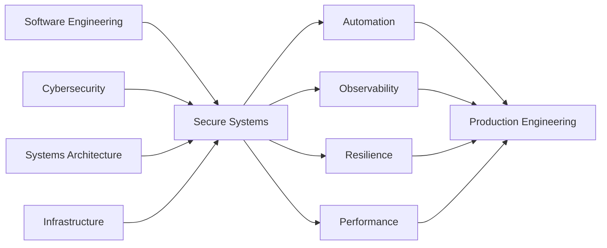

<div align="center">


<br>

# `BUILD. SECURE. ENGINEER. SCALE.`

### Software Engineering × Cybersecurity × Systems Architecture

<p align="center">
I build secure, resilient and performance-oriented systems —<br>
from low-level networking and security tooling to scalable software architecture.
</p>

<br>

<a href="https://github.com/mr-coder20">
  
</a>


<br><br>


</div>

---

## `$ whoami`

```text
ROLE        Software Engineer
DOMAIN      Cybersecurity / Systems / Infrastructure
FOCUS       Secure Architecture • Networking • Automation
MINDSET     Build systems that survive real-world conditions
MISSION     Engineer software that is secure by design
```

I work at the intersection of **software engineering, cybersecurity, networking and infrastructure**.

My engineering philosophy is simple:

> Software should not only work.
> It should be observable, secure, resilient, scalable and understandable.

---

# ⚡ Engineering Focus

<table>
<tr>
<td width="50%" valign="top">

### 🛡 Cybersecurity Engineering

```text
Network Security
Application Security
Traffic Analysis
Threat Detection
Security Automation
Resilience Engineering
```

I build tooling and systems focused on understanding **how software behaves under hostile or abnormal conditions**.

</td>
<td width="50%" valign="top">

### ⚙️ Systems Engineering

```text
System Architecture
Infrastructure
Networking
Concurrency
Performance Engineering
Automation
Observability
```

My focus extends beyond writing code into designing the **architecture and operational environment behind it**.

</td>
</tr>
</table>

---

# 🔥 Featured Engineering

<div align="center">

## `01 // FIRESCAN`

### Adaptive Multi-Engine Network Reconnaissance

**Masscan × Nmap × RustScan × Naabu × Pure-Go**


</div>

FireScan is a hybrid network reconnaissance engine designed around **multiple scanning backends, adaptive execution and structured reporting**.

```text
TARGET
   │
   ▼
┌─────────────────────────────┐
│        FireScan Core        │
├─────────────────────────────┤
│ Engine Selection            │
│ Adaptive Timing             │
│ Result Normalization        │
│ Failure / Fallback Handling │
└──────────────┬──────────────┘
               │
      ┌────────┼────────┐
      ▼        ▼        ▼
   Masscan    Nmap    RustScan
      │        │        │
      └────┬───┴────┬───┘
           ▼        ▼
         Naabu   Pure-Go
           │
           ▼
     Normalized Results
           │
     ┌─────┼─────┐
     ▼     ▼     ▼
    JSON  CSV   HTML
```

<p align="center">
<a href="https://github.com/mr-coder20/FireScan">

</a>
</p>

---

<div align="center">

## `02 // PORTX`

### Multi-Platform Network Security Toolkit


</div>

PortX explores a different side of security engineering:

**modern cross-platform tooling built around network visibility, performance and usability.**

```text
                   PORTX

        ┌────────────┴────────────┐
        │                         │
        ▼                         ▼
 NETWORK ENGINE              MODERN UI
        │                         │
        ▼                         ▼
 Port Analysis              Compose UI
 Discovery                  Multiplatform
 Security Logic             Visualization
        │                         │
        └────────────┬────────────┘
                     ▼
            SECURITY WORKSPACE
```

<p align="center">
<a href="https://github.com/mr-coder20/PortX">

</a>
</p>

---

<div align="center">

## `03 // L7 RESILIENCE SCANNER`

### Application-Layer Traffic Intelligence


</div>

A security research project focused on **HTTP traffic behavior, anomalous request patterns, bot activity and application-layer resilience**.

```text
HTTP TRAFFIC
     │
     ▼
 Request Analysis
     │
     ├──── Behavior Signals
     ├──── Request Patterns
     ├──── Frequency Analysis
     └──── Anomaly Detection
              │
              ▼
       Traffic Intelligence
              │
       ┌──────┴──────┐
       ▼             ▼
    NORMAL        SUSPICIOUS
                     │
                     ▼
               SECURITY SIGNAL
```

<p align="center">
<a href="https://github.com/mr-coder20/L7-Resilience-Scanner">

</a>
</p>

---

# 🧬 Engineering DNA



---

# 🛠 Technology Stack

<div align="center">

### Core Languages


<br><br>

### Systems & Infrastructure


<br><br>

### Engineering Environment


</div>

<br>

```text
LANGUAGES
├── Go
├── Python
├── Kotlin
├── Java
└── Bash

ENGINEERING
├── System Architecture
├── Network Engineering
├── Concurrent Systems
├── Automation
├── Performance
└── Observability

SECURITY
├── Network Security
├── Application Security
├── Traffic Analysis
├── Security Automation
├── Threat Detection
└── Resilience Engineering

INFRASTRUCTURE
├── Linux
├── Docker
├── Git
├── CI/CD
└── GitHub Actions
```

---

# 🧠 How I Engineer

```text
01
UNDERSTAND
│
├── What problem are we actually solving?
└── What are the real constraints?

          ↓

02
ARCHITECT
│
├── Design boundaries
├── Define responsibilities
└── Reduce unnecessary complexity

          ↓

03
BUILD
│
├── Maintainable implementation
├── Automation
├── Observability
└── Testing

          ↓

04
BREAK
│
├── Failure scenarios
├── Security assumptions
├── Performance limits
└── Edge cases

          ↓

05
HARDEN
│
├── Improve resilience
├── Reduce attack surface
├── Optimize bottlenecks
└── Strengthen architecture

          ↓

06
SCALE
```

---

# 📊 GitHub Engineering Activity

<div align="center">


<br>


</div>

---

# 🐍 Contribution Graph

<div align="center">


</div>

> Requires the GitHub Action that generates the contribution snake.

---

# 🛰 Current Direction

```text
                     ENGINEERING ROADMAP

                           2026
                             │
              ┌──────────────┼──────────────┐
              │              │              │
              ▼              ▼              ▼
          FireScan          PortX        L7 Security
              │              │              │
              ▼              ▼              ▼
        Recon Engine    Security UX    Traffic Intel
              │              │              │
              └──────────────┼──────────────┘
                             ▼
                  SECURITY ENGINEERING
                           ECOSYSTEM
                             │
                             ▼
                SYSTEMS • SECURITY • AI
```

My long-term direction is building an ecosystem around:

**Security Engineering · Infrastructure · Systems · Networking · Automation · AI-assisted Security**

---

# 🤝 Open Source

I am interested in collaborating on engineering projects involving:

`Cybersecurity` · `Networking` · `Infrastructure` · `Developer Tools` · `Automation` · `Systems Engineering`

Good engineering starts with a **real problem** — not a technology looking for one.

---

# 📡 Connect

<div align="center">

<a href="https://github.com/mr-coder20">

</a>

<a href="https://t.me/a_god_3_6_9">

</a>

</div>

---

<div align="center">

<br>

```text
┌──────────────────────────────────────────────────────┐
│                                                      │
│       BUILD SYSTEMS THAT DESERVE TO SURVIVE.         │
│                                                      │
│     SOFTWARE • SECURITY • SYSTEMS • ENGINEERING      │
│                                                      │
└──────────────────────────────────────────────────────┘
```

### `ENGINEER THE SYSTEM. SECURE THE SYSTEM. SCALE THE SYSTEM.`

<br>


</div>
