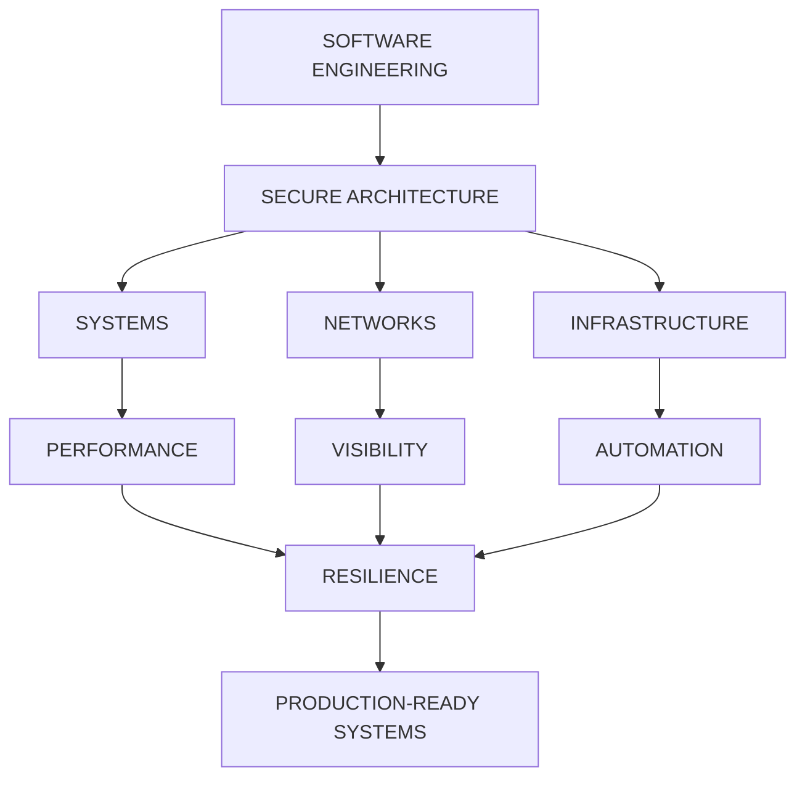

<div align="center">

<a href="https://github.com/mr-coder20">


</a>

<br>


<br><br>


<br><br>

> **BUILD SECURE SYSTEMS.**
> **ENGINEER THE ARCHITECTURE BEHIND THEM.**

</div>

---

<div align="center">

```text
╔══════════════════════════════════════════════════════════════════╗
║                                                                  ║
║   [ IDENTITY ]                                                   ║
║                                                                  ║
║   SOFTWARE ENGINEER                                              ║
║   ├── Cybersecurity Engineering                                 ║
║   ├── Systems Architecture                                      ║
║   ├── Network Engineering                                       ║
║   ├── Infrastructure                                             ║
║   └── Security Automation                                        ║
║                                                                  ║
║   [ OBJECTIVE ]                                                  ║
║                                                                  ║
║   BUILD → ANALYZE → HARDEN → AUTOMATE → SCALE                    ║
║                                                                  ║
╚══════════════════════════════════════════════════════════════════╝
```

</div>

# `root@mr-coder20:~# whoami`

I am a **Software Engineer** focused on building secure, resilient and performance-oriented systems.

My work lives where these domains intersect:

```text
                  SOFTWARE ENGINEERING
                         │
          ┌──────────────┼──────────────┐
          │              │              │
          ▼              ▼              ▼
      SECURITY        NETWORKS       SYSTEMS
          │              │              │
          └──────────────┼──────────────┘
                         │
                         ▼
                 INFRASTRUCTURE
                         │
                         ▼
                    AUTOMATION
                         │
                         ▼
                     RESILIENCE
```

I don't treat security as an afterthought.

**Security is an architectural property.**

---

# `./focus --verbose`

<div align="center">

|          `01`         |      `02`      |         `03`        |
| :-------------------: | :------------: | :-----------------: |
| 🛡️ **CYBERSECURITY** | ⚙️ **SYSTEMS** |  🌐 **NETWORKING**  |
| Detection Engineering |  Architecture  |   Network Analysis  |
|  Application Security |   Performance  |      Protocols      |
|  Security Automation  |   Concurrency  |    Infrastructure   |
|       Resilience      |  Observability | Distributed Systems |

</div>

---

# `./projects --classified`

<div align="center">

## `████████████████████████████████`

## `PROJECT // FIRESCAN`

### `ADAPTIVE NETWORK RECONNAISSANCE ENGINE`

## `████████████████████████████████`


</div>

> **Five engines. One orchestration layer. Adaptive execution.**

```text
                         FIRESCAN
                            │
                  ┌─────────┴─────────┐
                  │   ORCHESTRATOR    │
                  └─────────┬─────────┘
                            │
          ┌─────────┬───────┼───────┬─────────┐
          ▼         ▼       ▼       ▼         ▼
       MASSCAN    NMAP   RUSTSCAN  NAABU   PURE-GO
          │         │       │       │         │
          └─────────┴───────┼───────┴─────────┘
                            ▼
                  RESULT NORMALIZATION
                            │
              ┌─────────────┼─────────────┐
              ▼             ▼             ▼
             JSON          CSV           HTML
```

FireScan is designed around **hybrid scanning, engine orchestration, adaptive timing and normalized reporting**.

<a href="https://github.com/mr-coder20/FireScan">

</a>

---

<div align="center">

## `████████████████████████████████`

## `PROJECT // PORTX`

### `MULTI-PLATFORM NETWORK SECURITY TOOLKIT`

## `████████████████████████████████`


</div>

```text
                         PORTX
                           │
             ┌─────────────┴─────────────┐
             │                           │
             ▼                           ▼
       NETWORK ENGINE                SECURITY UX
             │                           │
       ┌─────┼─────┐                ┌────┼────┐
       ▼     ▼     ▼                ▼    ▼    ▼
    ANALYZE SCAN  DISCOVER        VISUALIZE CONTROL MONITOR
             │                           │
             └─────────────┬─────────────┘
                           ▼
                  SECURITY WORKSPACE
```

A modern engineering approach to **cross-platform network security tooling**, built with Kotlin Multiplatform and Compose.

<a href="https://github.com/mr-coder20/PortX">

</a>

---

<div align="center">

## `████████████████████████████████`

## `PROJECT // L7-RESILIENCE-SCANNER`

### `APPLICATION-LAYER TRAFFIC INTELLIGENCE`

## `████████████████████████████████`


</div>

```text
                         HTTP TRAFFIC
                              │
                              ▼
                    ┌──────────────────┐
                    │ REQUEST ANALYSIS │
                    └────────┬─────────┘
                             │
             ┌───────────────┼───────────────┐
             ▼               ▼               ▼
        BEHAVIOR          PATTERNS         RATE
         SIGNALS          ANALYSIS       ANALYSIS
             │               │               │
             └───────────────┼───────────────┘
                             ▼
                     ANOMALY ENGINE
                             │
                    ┌────────┴────────┐
                    ▼                 ▼
                 NORMAL           SUSPICIOUS
                                      │
                                      ▼
                               SECURITY SIGNAL
```

Focused on **bot activity, anomalous requests, application-layer attacks and HTTP traffic behavior**.

<a href="https://github.com/mr-coder20/L7-Resilience-Scanner">

</a>

---

# `./architecture --mindset`



---

# `./stack --scan`

<div align="center">

### `LANGUAGES`


### `SYSTEMS`


### `ENGINEERING`


</div>

```text
┌─────────────────────────────────────────────────────────────┐
│                       ENGINEERING STACK                      │
├─────────────────────────────────────────────────────────────┤
│                                                             │
│  LANGUAGES                                                  │
│  ├─ Go                                                      │
│  ├─ Python                                                  │
│  ├─ Kotlin                                                  │
│  ├─ Java                                                    │
│  └─ Bash                                                    │
│                                                             │
│  SYSTEMS                                                    │
│  ├─ Linux                                                   │
│  ├─ Docker                                                  │
│  ├─ Networking                                               │
│  ├─ Concurrency                                             │
│  └─ Infrastructure                                          │
│                                                             │
│  SECURITY                                                    │
│  ├─ Network Security                                        │
│  ├─ Application Security                                    │
│  ├─ Traffic Analysis                                        │
│  ├─ Threat Detection                                        │
│  └─ Security Automation                                     │
│                                                             │
└─────────────────────────────────────────────────────────────┘
```

---

# `./principles`

### `01` — SECURITY BY DESIGN

Security should exist inside the architecture, not as a final checklist.

### `02` — ENGINEER THE FAILURE

A system is not truly understood until its failure modes are understood.

### `03` — AUTOMATE THE REPETITIVE

Engineering time belongs to architecture and problem solving, not repetitive operations.

### `04` — MEASURE BEFORE OPTIMIZING

Performance claims should be reproducible, measurable and contextual.

### `05` — DESIGN FOR RESILIENCE

Real systems operate under imperfect conditions.

---

# `./pipeline --execute`

```text
        ┌─────────────┐
        │    IDEA     │
        └──────┬──────┘
               │
               ▼
        ┌─────────────┐
        │   RESEARCH  │
        └──────┬──────┘
               │
               ▼
        ┌─────────────┐
        │ ARCHITECTURE│
        └──────┬──────┘
               │
               ▼
        ┌─────────────┐
        │    BUILD    │
        └──────┬──────┘
               │
               ▼
        ┌─────────────┐
        │    TEST     │
        └──────┬──────┘
               │
               ▼
        ┌─────────────┐
        │   HARDEN    │
        └──────┬──────┘
               │
               ▼
        ┌─────────────┐
        │   RELEASE   │
        └──────┬──────┘
               │
               ▼
        ┌─────────────┐
        │    SCALE    │
        └─────────────┘
```

---

# `./status`

<div align="center">


</div>

```text
[✓] Software Engineering
[✓] Cybersecurity
[✓] Systems Architecture
[✓] Network Engineering
[✓] Infrastructure
[✓] Automation
[→] AI-assisted Security
[→] Open Source Engineering
```

---

# `./github --activity`

<div align="center">


<br><br>


</div>

---

# `./contributions --visualize`

<div align="center">


</div>

---

# `./roadmap --global`

```text
                         2026+
                           │
              ┌────────────┼────────────┐
              │            │            │
              ▼            ▼            ▼
           FIRESCAN      PORTX        L7-RS
              │            │            │
              ▼            ▼            ▼
        RECON ENGINE   SECURITY UX   L7 INTEL
              │            │            │
              └────────────┼────────────┘
                           │
                           ▼
                 SECURITY ECOSYSTEM
                           │
               ┌───────────┼───────────┐
               ▼           ▼           ▼
             SYSTEMS    SECURITY       AI
               │           │           │
               └───────────┼───────────┘
                           ▼
                  OPEN SOURCE SYSTEMS
```

---

# `./collaborate`

I'm interested in serious engineering collaborations around:

```text
Cybersecurity
Networking
Infrastructure
Developer Tools
Automation
Systems Engineering
Security Research
AI-assisted Engineering
Open Source
```

If you're building something technically ambitious, let's build it properly.

---

# `./connect`

<div align="center">

<a href="https://github.com/mr-coder20">

</a>

<a href="https://t.me/a_god_3_6_9">

</a>

</div>

---

<div align="center">

```text
╔════════════════════════════════════════════════════════════════════╗
║                                                                    ║
║   [ SYSTEM MESSAGE ]                                               ║
║                                                                    ║
║   SOFTWARE IS THE SYSTEM.                                          ║
║   SECURITY IS THE ARCHITECTURE.                                    ║
║   RESILIENCE IS THE STANDARD.                                      ║
║                                                                    ║
║   BUILD → SECURE → BREAK → HARDEN → SCALE                          ║
║                                                                    ║
╚════════════════════════════════════════════════════════════════════╝
```

<br>


<br><br>


</div>
